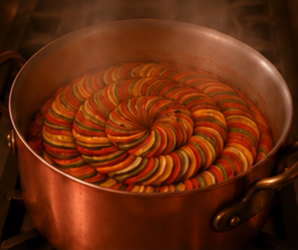

# Clase 10

## Plantilla examen

Haz click  en README.md, luego en `raw` para ve código base de plantilla

## Link de web pública (github pages)

<https://fdaceituno.github.io/proyecto-pensamiento-computacional-s5/>

### Título del proyecto

Storyboard Ratatouille

### Referencia de origen / bibliografía

Película Ratatouille, dirigida por Brad Bird y producida por Pixar Animation Studios para Walt Disney Pictures,
estrenada el 29 de junio de 2007

### Imagen de referencia de proyecto

 

### Integrantes

Estudiante [fdaceituno](https://github.com/fdaceituno)

### Enlace de p5.js 

<https://editor.p5js.org/fda.aceituno/sketches/2sPjeYFnh>

### Relato inicial

Remi está guiando a Linguini para que pueda cocinar bien, luego preparan el plato "ratatouille" el cual sería probado por un crítico,
y finalmente Anton Ego, el crítico, pueba el plato y se transporta a su niñez recordando cuando comía ese plato hecho por su madre, por lo que lo disfrutó mucho

### Storyboard

Imágenes del storyboard, las que deben verse acá y estar subidas en el mismo repositorio

### Estados

Describe acá los estados de tu máquina (mínimo 3 para proyectos individuales, 6 para parejas, 9 para tríos), y la condición de salida. Incluye la sección de código que muestra ese estado

#### Estado 1

En el primer estado, Remi mueve sus manos(patas) de a una, jalando mechones de cabello de Linguini hacia arriba

al hacer clic, Remi empieza a jalar el pelo hacia abajo, y luego nuevamente hacia arriba y hacia abajo

continuando con clic después de los 4 primeros, aparece Linguini repitiendo los mismo movimientos guiados por Remi pero con el movimiento de un cuchillo

```Clics frames
if(escena==1){
contadorClicks++;
if(contadorClicks==1){
frameActual=1;
}
else if(contadorClicks==2){
frameActual=0;
}
else if(contadorClicks==3){
frameActual=1;
}
else if(contadorClicks==4){
frameActual=2;
}
else if(contadorClicks==5){
frameActual=3;
}
else if(contadorClicks==6){
frameActual=2;
}
else if(contadorClicks==7){
frameActual=3;
}
else{
escena=2;
frameActual=0;
contadorClicks=0;
empiezoCirculo=false;
}
return;
}
```


#### Estado 2

Revolviendo la olla

Al mover el mouse de forma circular en torno al centro, los frames van avanzando mostrando la secuencia de revolver la olla

terminando con un frame de la comida lista, es decir, la preparación de la receta "ratatouille" ya terminada

```Movimiento circular
     //para comenzar mov
     if(mouseIsPressed){
       empiezoCirculo=true
     }
     if(empiezoCirculo){
       //para calcular el ángulo del mouse respecto al centro
       let angulo=atan2(
         mouseY-height/2,
         mouseX-width/2
       );
       //calcular cuanto giró el mouse
       let diferencia=abs(angulo-anguloAnterior);
       //para sumar el mov circular
       acumuladorCircular+=diferencia
       anguloAnterior=angulo;
       //al llegar acá cambia de frame
       if(acumuladorCircular>1.5){
         acumuladorCircular=0;
         frameActual++;
       //y cuando termina pasa a la escena 3
        if(frameActual>3){
          escena=3;
          frameActual=0
          listoParaVolver=false
          arrastrando=false
        }
       }
     }
    }
```

#### Estado 3

Anton Ego prueba el plato

al presionar al centro y arrastrar hacia la esquina inferior derecha, 

se ve como el crítico se retira el tenedor de la boca, y tiene un paso a su infancia

recordando cuando el comía esa comida, y termina con un frame de el drisfrutando del plato

``` Para detectar que el usuario comenzó el arrastre
if(listoParaVolver){
arrastrando=true;
inicioX=mouseX;
inicioY=mouseY;
return;
}
let centroX=width/2;
let centroY=height/2;
if(dist(mouseX,mouseY,centroX,centroY)<150){
arrastrando=true;
inicioX=mouseX;
inicioY=mouseY;
}
}
```Cambio de frames
function mouseDragged(){
//para avanzar frames con arrastre diagonal
if(escena!=3 || !arrastrando){
return;
}
let dx=mouseX-inicioX;
let dy=mouseY-inicioY;

*aquí va parte del ultimo mov para cambiar de escena3 a escena1

// PRIMER ARRASTRE (animación)
let distancia=sqrt(dx*dx+dy*dy);
  //eso cualcula cuanto se movió el mouse
  //mientra más se arrastra más avanzan los frames
if(distancia<100){
frameActual=0;
}
else if(distancia<200){
frameActual=1;
}
else if(distancia<250){
frameActual=2;
}
else if(distancia<300){
frameActual=3;
}
else if(distancia<350){
frameActual=4;
}
else{
frameActual=5;
```
#### Reinicio
Al terminar la escena 3, se puede volver a la escena 1 y (repetir todos los pasos siguientes)
haciendo click desde el lado derecho, deslizando hacia la izquierda
```Arrastre hacia la izquierda
function mouseDragged(){
//para avanzar frames con arrastre diagonal
if(escena!=3 || !arrastrando){
return;
}
```
```Reinicio de escenas
x<-200){
escena=1;
frameActual=0;
contadorClicks=0;

listoParaVolver=false;
arrastrando=false;
empiezoCirculo=false;
}

return;
}
```
